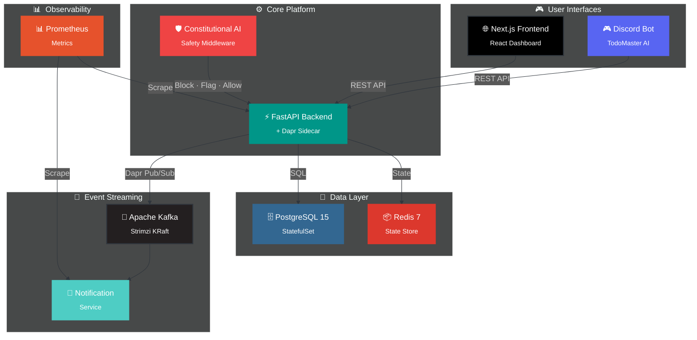
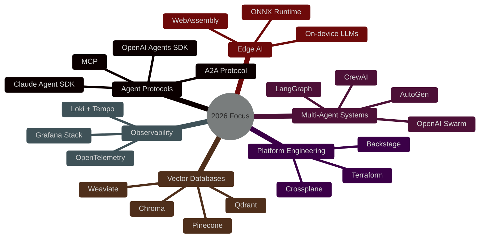

<div align="center">

[](https://git.io/typing-svg)

<br/>

<a href="https://www.linkedin.com/in/asadullah-shafique-a00679325"></a>&ensp;
<a href="https://medium.com/@texcotembroiderysourcinghouse"></a>&ensp;
<a href="https://youtube.com/@asadullahshafique4261"></a>&ensp;
<a href="https://linktr.ee/asadullahshafique"></a>&ensp;
<a href="https://www.facebook.com/asadullah.shafique?mibextid=ZbWKwL"></a>

</div>

<br/>


<!-- ━━━━━━━━━━━━━━━━━━━━━━━━━━━━━━━━━━━━━━━━━━━━━━━━━━━━━━━━━━━━━━ -->
##  &nbsp;Who I Am
<!-- ━━━━━━━━━━━━━━━━━━━━━━━━━━━━━━━━━━━━━━━━━━━━━━━━━━━━━━━━━━━━━━ -->

<div align="center">

> **Agentic AI Developer** at [Panaversity](https://github.com/panaversity) — I build autonomous AI systems that **take action**, not just respond.
>
> Completed **6 progressive hackathons** evolving a simple file watcher into a **Kubernetes-orchestrated platform** with Constitutional AI safety, Kafka event streaming, Dapr service mesh, and a Discord bot.

</div>

<br/>

<div align="center">

&ensp;
&ensp;
&ensp;
&ensp;


</div>

<br/>

<table>
<tr>
<td width="50%" valign="top">

###  &nbsp;At a Glance

```yaml
role        : Agentic AI Developer @ Panaversity
hackathons  : 6/6 completed (Bronze → Platinum)
k8s_cluster : 14 services · 6GB · 44% memory
tests       : 180+ passing
methodology : Specification-First Development
focus       : Multi-Agent Systems (MCP + A2A)
```

</td>
<td width="50%" valign="top">

###  &nbsp;Currently Building

&nbsp;&nbsp;**`01`**&ensp;Multi-agent systems with **MCP** & **A2A** protocols
<br/>
&nbsp;&nbsp;**`02`**&ensp;Production RAG with vector databases
<br/>
&nbsp;&nbsp;**`03`**&ensp;Platform engineering for AI workloads
<br/>
&nbsp;&nbsp;**`04`**&ensp;Open-source AI safety tooling
<br/>
&nbsp;&nbsp;**`05`**&ensp;Technical content on **YouTube** & **Medium**

</td>
</tr>
</table>

<br/>


<!-- ━━━━━━━━━━━━━━━━━━━━━━━━━━━━━━━━━━━━━━━━━━━━━━━━━━━━━━━━━━━━━━ -->
##  &nbsp;Flagship Project
<!-- ━━━━━━━━━━━━━━━━━━━━━━━━━━━━━━━━━━━━━━━━━━━━━━━━━━━━━━━━━━━━━━ -->

<div align="center">

<a href="https://github.com/asadullah48/hackathon-completion-engine">

</a>

<br/><br/>

<a href="https://github.com/asadullah48/hackathon-completion-engine">
  &ensp;
  &ensp;
  &ensp;
  &ensp;
  &ensp;
  
</a>

</div>

<br/>

<div align="center">

> A production-grade, Kubernetes-orchestrated AI platform built across **6 progressive hackathons** — featuring Constitutional AI safety, event-driven microservices, and multi-interface access.

</div>

<br/>


```mermaid
%%{init: {'theme': 'dark', 'themeVariables': {'primaryColor': '#1f6feb', 'primaryTextColor': '#e6edf3', 'lineColor': '#30363d', 'secondaryColor': '#161b22', 'tertiaryColor': '#0d1117'}}}%%
graph TD
    subgraph "🎮 &nbsp;User Interfaces"
        A["🎮 Discord Bot<br/><sub>TodoMaster AI</sub>"]
        C["🌐 Next.js Frontend<br/><sub>React Dashboard</sub>"]
    end

    subgraph "⚙️ &nbsp;Core Platform"
        B["⚡ FastAPI Backend<br/><sub>+ Dapr Sidecar</sub>"]
        I["🛡️ Constitutional AI<br/><sub>Safety Middleware</sub>"]
    end

    subgraph "💾 &nbsp;Data Layer"
        D["🗄️ PostgreSQL 15<br/><sub>StatefulSet</sub>"]
        H["📦 Redis 7<br/><sub>State Store</sub>"]
    end

    subgraph "📡 &nbsp;Event Streaming"
        E["📡 Apache Kafka<br/><sub>Strimzi KRaft</sub>"]
        F["🔔 Notification<br/><sub>Service</sub>"]
    end

    subgraph "📊 &nbsp;Observability"
        G["📊 Prometheus<br/><sub>Metrics</sub>"]
    end

    A -->|REST API| B
    C -->|REST API| B
    I -->|Block · Flag · Allow| B
    B -->|SQL| D
    B -->|State| H
    B -->|Dapr Pub/Sub| E
    E --> F
    G -->|Scrape| B
    G -->|Scrape| F

    style A fill:#5865F2,color:#fff,stroke:#5865F2,stroke-width:2px
    style C fill:#000000,color:#fff,stroke:#30363d,stroke-width:2px
    style B fill:#009688,color:#fff,stroke:#009688,stroke-width:2px
    style I fill:#EF4444,color:#fff,stroke:#EF4444,stroke-width:2px
    style D fill:#336791,color:#fff,stroke:#336791,stroke-width:2px
    style H fill:#DC382D,color:#fff,stroke:#DC382D,stroke-width:2px
    style E fill:#231f20,color:#fff,stroke:#30363d,stroke-width:2px
    style F fill:#4ECDC4,color:#fff,stroke:#4ECDC4,stroke-width:2px
    style G fill:#e6522c,color:#fff,stroke:#e6522c,stroke-width:2px
```

<details>
<summary>&ensp;<b>Key Differentiators</b></summary>

<br/>

| Feature | Implementation |
|:--------|:---------------|
| **Constitutional AI** | Blocks homework-solving queries with Socratic responses, flags edge cases for human review |
| **Zero-Code Infra Swap** | Switched pub/sub from Redis → Kafka by changing 1 YAML file (Dapr abstraction) |
| **14 Services in 6GB** | Full production stack at 44% memory utilization on Minikube |
| **Event-Driven Audit** | Every interaction published to Kafka with 24h retention |
| **Multi-Interface** | Same backend serves Next.js frontend + Discord bot (TodoMaster AI) |

</details>

<details>
<summary>&ensp;<b>Hackathon Progression — Bronze → Platinum</b></summary>

<br/>

| # | Project | Tier | What I Built | Tests |
|:-:|:--------|:-----|:-------------|:-----:|
| **0** | Personal AI CTO | `Bronze` | File watcher, auto-categorization, HITL approvals | 7/7 |
| **1** | Course Companion | `Silver` | FastAPI backend, Constitutional AI filter, conversation tracking | — |
| **2** | AI-Powered Todo | `Silver` | Spec-driven development, AI spec generation, CRUD with constitution | — |
| **3** | Advanced Todo | `Gold` | Event-driven architecture, Kafka, Dapr, team collaboration | 149/149 |
| **4** | Cloud-Native | `Platinum` | Full Kubernetes cluster (14 manifests), CI/CD, Prometheus | — |
| **4.5** | Discord Bot | `Extended` | TodoMaster AI with 6 slash commands, K8s deployment | 31/31 |

</details>

<br/>


<!-- ━━━━━━━━━━━━━━━━━━━━━━━━━━━━━━━━━━━━━━━━━━━━━━━━━━━━━━━━━━━━━━ -->
##  &nbsp;Other Projects
<!-- ━━━━━━━━━━━━━━━━━━━━━━━━━━━━━━━━━━━━━━━━━━━━━━━━━━━━━━━━━━━━━━ -->

<div align="center">

| &nbsp; | Project | Stack | Description |
|:------:|:--------|:------|:------------|
| **01** | **Physical AI Textbook Platform** | Next.js · FastAPI · RAG · Gemini | Interactive textbook with semantic search and context-aware RAG chatbot |
| **02** | **LearnFlow AI Platform** | Microservices · FastAPI · K8s · Docker | 5 specialized AI agents for personalized programming education |
| **03** | **Course Companion FTE** | FastAPI · ChatGPT API · Zero-Backend | Constitutional AI rules for LLM-based course management |
| **04** | **Claude.ai Skills Marketplace** | 39 Skills · 8 Categories | Reusable agent skills — doc processing, automation, dev tools |

</div>

<br/>


<!-- ━━━━━━━━━━━━━━━━━━━━━━━━━━━━━━━━━━━━━━━━━━━━━━━━━━━━━━━━━━━━━━ -->
##  &nbsp;Tech Stack
<!-- ━━━━━━━━━━━━━━━━━━━━━━━━━━━━━━━━━━━━━━━━━━━━━━━━━━━━━━━━━━━━━━ -->

<div align="center">

**`LANGUAGES & FRAMEWORKS`**

[](https://skillicons.dev)

**`CLOUD-NATIVE & INFRASTRUCTURE`**

[](https://skillicons.dev)

**`AI · TOOLS · PLATFORMS`**

[](https://skillicons.dev)

</div>

<details>
<summary>&ensp;<b>Full Stack Breakdown</b></summary>

<br/>

```javascript
const techStack = {
    languages      : ["Python", "TypeScript", "JavaScript"],
    frontend       : ["Next.js 14", "React", "Tailwind CSS"],
    backend        : ["FastAPI", "Node.js", "Uvicorn"],
    ai_ml          : ["Constitutional AI", "RAG Systems", "LangChain", "LangGraph", "MCP"],
    databases      : ["PostgreSQL 15", "Redis 7", "Pinecone", "Chroma"],
    infrastructure : ["Kubernetes", "Docker", "Dapr", "Helm"],
    streaming      : ["Apache Kafka (Strimzi KRaft)"],
    monitoring     : ["Prometheus", "Grafana", "OpenTelemetry"],
    cicd           : ["GitHub Actions — test → build → validate → security"],
    bots           : ["discord.py (slash commands)"],
    apis           : ["OpenAI", "Claude (Anthropic)", "Google Gemini"],
    protocols      : ["MCP", "A2A", "REST", "Dapr Pub/Sub"],
    architecture   : ["Microservices", "Event-Driven", "API-First"],
    methodology    : "Specification-First Development"
};
```

</details>

<br/>


<!-- ━━━━━━━━━━━━━━━━━━━━━━━━━━━━━━━━━━━━━━━━━━━━━━━━━━━━━━━━━━━━━━ -->
## 🗺️ &nbsp;2026 Roadmap
<!-- ━━━━━━━━━━━━━━━━━━━━━━━━━━━━━━━━━━━━━━━━━━━━━━━━━━━━━━━━━━━━━━ -->

<div align="center">


```mermaid
%%{init: {'theme': 'dark'}}%%
mindmap
  root((2026 Focus))
    Agent Protocols
      MCP
      A2A Protocol
      Claude Agent SDK
      OpenAI Agents SDK
    Multi-Agent Systems
      LangGraph
      CrewAI
      AutoGen
      OpenAI Swarm
    Observability
      OpenTelemetry
      Grafana Stack
      Loki + Tempo
    Vector Databases
      Pinecone
      Qdrant
      Chroma
      Weaviate
    Edge AI
      WebAssembly
      ONNX Runtime
      On-device LLMs
    Platform Engineering
      Backstage
      Crossplane
      Terraform
```

</div>

<br/>

| Area | Technologies | Why It Matters |
|:-----|:-------------|:---------------|
| **Agent Protocols** | MCP, A2A, Claude Agent SDK | Standardizing how AI agents communicate and use tools |
| **Multi-Agent Systems** | LangGraph, CrewAI, AutoGen, Swarm | Orchestrating specialized agents for complex workflows |
| **Observability** | OpenTelemetry, Grafana (Loki + Tempo) | Unified telemetry for AI-native applications |
| **Vector Databases** | Pinecone, Qdrant, Chroma, Weaviate | Scaling RAG systems to production |
| **Edge AI** | WebAssembly, ONNX Runtime | Running inference at the edge without cloud dependency |
| **Platform Engineering** | Backstage, Crossplane, Terraform | Internal developer platforms for AI workloads |
| **AI Safety** | Constitutional AI, RLHF, HITL | Ensuring AI systems are safe and aligned |

<br/>


<!-- ━━━━━━━━━━━━━━━━━━━━━━━━━━━━━━━━━━━━━━━━━━━━━━━━━━━━━━━━━━━━━━ -->
## 📊 &nbsp;GitHub Analytics
<!-- ━━━━━━━━━━━━━━━━━━━━━━━━━━━━━━━━━━━━━━━━━━━━━━━━━━━━━━━━━━━━━━ -->

<div align="center">

[](https://github.com/ryo-ma/github-profile-trophy)

<br/>


<br/>

[](https://github.com/anuraghazra/github-readme-stats)

<br/>

[](https://github.com/Ashutosh00710/github-readme-activity-graph)

<br/>

<picture>
  <source media="(prefers-color-scheme: dark)" srcset="https://raw.githubusercontent.com/asadullah48/asadullah48/output/github-snake-dark.svg" />
  <source media="(prefers-color-scheme: light)" srcset="https://raw.githubusercontent.com/asadullah48/asadullah48/output/github-snake.svg" />
  
</picture>

</div>

<br/>


<!-- ━━━━━━━━━━━━━━━━━━━━━━━━━━━━━━━━━━━━━━━━━━━━━━━━━━━━━━━━━━━━━━ -->
## 🎯 &nbsp;Goals
<!-- ━━━━━━━━━━━━━━━━━━━━━━━━━━━━━━━━━━━━━━━━━━━━━━━━━━━━━━━━━━━━━━ -->

<table>
<tr>
<td width="50%" valign="top">

#### &ensp;Completed

&ensp;&ensp;✅&ensp;Complete all 6 Panaversity Hackathons (Bronze → Platinum)
<br/>
&ensp;&ensp;✅&ensp;Build cloud-native system with K8s, Kafka, and Dapr
<br/>
&ensp;&ensp;✅&ensp;Implement Constitutional AI safety with HITL

</td>
<td width="50%" valign="top">

#### &ensp;In Progress

&ensp;&ensp;⬜&ensp;Build multi-agent system with MCP & A2A protocols
<br/>
&ensp;&ensp;⬜&ensp;Contribute to 3+ open-source AI/ML projects
<br/>
&ensp;&ensp;⬜&ensp;Publish 24+ technical articles and videos
<br/>
&ensp;&ensp;⬜&ensp;Launch course on Spec-Driven AI Development
<br/>
&ensp;&ensp;⬜&ensp;Grow YouTube channel to 1K+ subscribers

</td>
</tr>
</table>

<br/>


<!-- ━━━━━━━━━━━━━━━━━━━━━━━━━━━━━━━━━━━━━━━━━━━━━━━━━━━━━━━━━━━━━━ -->
## 💡 &nbsp;Philosophy
<!-- ━━━━━━━━━━━━━━━━━━━━━━━━━━━━━━━━━━━━━━━━━━━━━━━━━━━━━━━━━━━━━━ -->

<div align="center">

> *"Traditional approach: Avoid AI mistakes.*
> *My approach: Learn FROM AI mistakes.*
> *Because real innovation happens at the edges of failure."*

<br/>

| | Principle | Practice |
|:-:|:----------|:---------|
| `01` | **Spec-First** | No code without a specification |
| `02` | **Production Quality** | Every project is deployment-ready |
| `03` | **AI as Collaborator** | Not just a tool — a thinking partner |
| `04` | **Open Source** | Share knowledge, elevate the community |

</div>

<br/>


<!-- ━━━━━━━━━━━━━━━━━━━━━━━━━━━━━━━━━━━━━━━━━━━━━━━━━━━━━━━━━━━━━━ -->
## ✍️ &nbsp;Writing & Content
<!-- ━━━━━━━━━━━━━━━━━━━━━━━━━━━━━━━━━━━━━━━━━━━━━━━━━━━━━━━━━━━━━━ -->

<div align="center">

<a href="https://youtube.com/@asadullahshafique4261"></a>&ensp;
<a href="https://medium.com/@texcotembroiderysourcinghouse"></a>

<br/><br/>

`Agentic AI` · `Spec-Driven Development` · `Cloud-Native Architecture` · `Constitutional AI Safety` · `Multi-Agent Systems`

</div>

<br/>

<!-- ━━━━━━━━━━━━━━━━━━━━━━━━━━━━━━━━━━━━━━━━━━━━━━━━━━━━━━━━━━━━━━ -->


<br/>

<div align="center">

### Let's Build Something Together

<sub>Open to collaborating on **AI/ML projects**, **cloud-native systems**, and **hackathon partnerships**.</sub>

<br/>

<a href="https://www.linkedin.com/in/asadullah-shafique-a00679325"></a>&ensp;
<a href="https://medium.com/@texcotembroiderysourcinghouse"></a>&ensp;
<a href="https://youtube.com/@asadullahshafique4261"></a>&ensp;
<a href="https://www.facebook.com/asadullah.shafique?mibextid=ZbWKwL"></a>&ensp;
<a href="https://linktr.ee/asadullahshafique"></a>

<br/><br/>


</div>

<br/>


