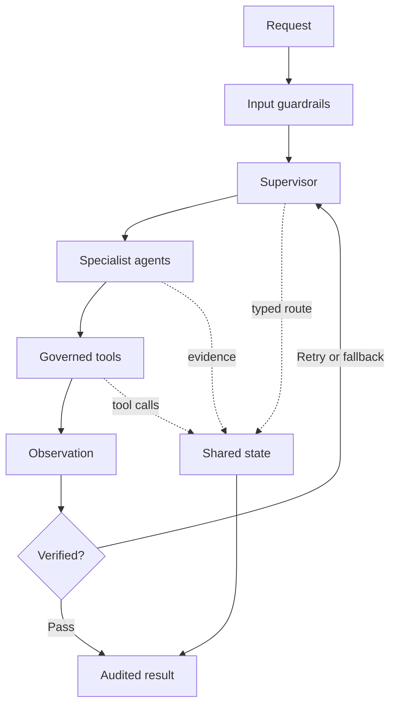

<div align="center">

[](https://asadullahshafique-devunity.vercel.app/)

<br/>

[](https://asadullahshafique-devunity.vercel.app)
[](https://www.linkedin.com/in/asadullah-shafique-a00679325)
[](https://github.com/asadullah48?tab=repositories)

<br/>


`Agent Orchestration` · `MCP` · `A2A` · `Guardrails` · `Evaluation` · `Kubernetes`

</div>

---

## What I build

I design agentic systems around a simple engineering principle:

> A model generates intelligence. The system determines whether that intelligence can be trusted.

My work connects **AI engineering, full-stack systems, cloud-native infrastructure, and real business operations**. I focus on the parts that make agents useful beyond a demo: deterministic routing, governed tool access, typed state, evaluation, fallbacks, observability, and human approval boundaries.

I also lead **Texcot Embroidery Sourcing House**, which gives me direct experience with production, inventory, orders, customers, deadlines, and the realities software must survive outside the codebase.

---

## Verified engineering evidence

Every claim below links to inspectable source code or a live system.

| Discipline | Evidence | Inspect |
|---|---:|---|
| Deterministic orchestration | **39 tests · 0 API keys** | [OrchestratorX tests](https://github.com/asadullah48/orchestratorx/tree/main/tests) |
| MCP × A2A interoperability | **61 tests · protocol-level transport** | [ProtoBridge protocols](https://github.com/asadullah48/protobridge/tree/main/src/protobridge/protocols) |
| Deterministic guardrails | **17 tests · 3 compliance domains** | [GuardrailAI controls](https://github.com/asadullah48/guardrailai/tree/main/guardrailai/guardrails) |
| Portfolio agent runtime | **Typed routes · tools · fallbacks** | [Source](https://github.com/asadullah48/asadullahshafique_devunity) · [Live](https://asadullahshafique-devunity.vercel.app/) |

> Test counts describe the linked repositories at the time of verification. The portfolio states limitations and distinguishes representative traces from captured production telemetry.

---

## Flagship agentic systems

<table>
<tr>
<td width="33%" valign="top">

### [OrchestratorX](https://github.com/asadullah48/orchestratorx)

**Deterministic multi-agent orchestration**

A supervisor-pattern framework that keeps routing in typed state and plain Python. Required specialists, termination, failure handling, and audit traces are enforced as testable invariants.

`LangGraph` `Pydantic` `FastAPI` `pytest`

</td>
<td width="33%" valign="top">

### [ProtoBridge](https://github.com/asadullah48/protobridge)

**MCP × A2A interoperability**

A governed protocol layer implementing real JSON-RPC over MCP stdio and A2A HTTP while preserving identity, sensitivity, and correlation context across boundaries.

`MCP` `A2A` `JSON-RPC` `Python`

</td>
<td width="33%" valign="top">

### [GuardrailAI](https://github.com/asadullah48/guardrailai)

**Deterministic agent governance**

Pre-flight controls, bounded execution, post-flight enforcement, circuit breakers, and SHA-256 hash-chained audit records around probabilistic agents.

`Guardrails` `Circuit Breakers` `Auditability`

</td>
</tr>
</table>

[**Read the full architecture case studies →**](https://asadullahshafique-devunity.vercel.app/#projects)

---

## Harness × Loop × Graph

| Layer | Engineering question | What I implement |
|---|---|---|
| **Harness** | What can the agent see and do? | Scoped tools, memory, permissions, typed state, protocol boundaries |
| **Loop** | How does the system know the work is correct? | Evidence, trace assertions, evaluations, retries, verification |
| **Graph** | Who acts next, and what happens on failure? | Deterministic routing, approvals, termination, fallback paths |

**Model → Harness → Loop → Graph → Tools & Protocols → Guardrails → Evaluation → Observability**

---

## Agent system architecture

<div align="center">

> One governed request path—from intent to verified, auditable execution.

</div>


```mermaid
flowchart TD
    A["Request"] --> B["Input guardrails"]
    B --> C["Supervisor"]
    C --> D["Specialist agents"]
    D --> E["Governed tools"]
    E --> F["Observation"]
    F --> G{"Verified?"}
    G -->|Retry or fallback| C
    G -->|Pass| H["Audited result"]

    C -. typed route .-> I["Shared state"]
    D -. evidence .-> I
    E -. tool calls .-> I
    I --> H
```

| Control | Engineering guarantee |
|---|---|
| **Supervisor routing** | One deterministic decision point controls every handoff |
| **Guardrails** | Policy checks run before and after probabilistic execution |
| **Verification loop** | Evidence—not confidence—decides whether work passes |
| **Typed shared state** | Routes, observations, tool calls, and failures remain inspectable |
| **Audit result** | The final response can be traced back to the execution path |

<div align="center">

[**Inspect the interactive nine-stage agent trace →**](https://asadullahshafique-devunity.vercel.app/#agent-trace)

</div>

---

## Selected systems

| System | Outcome | Evidence |
|---|---|---|
| [Agentic OS Portfolio](https://asadullahshafique-devunity.vercel.app/) | A portfolio that exposes its architecture, agent runtime, trace model, and source evidence | [Repository](https://github.com/asadullah48/asadullahshafique_devunity) |
| [Textile ERP Platform](https://github.com/asadullah48/textile-erp-platform) | Multi-tenant fabric inventory SaaS with PostgreSQL row-level security | [Repository](https://github.com/asadullah48/textile-erp-platform) |
| [Hackathon Completion Engine](https://github.com/asadullah48/hackathon-completion-engine) | Event-driven AI platform using FastAPI, Kafka, Dapr, Kubernetes, and safety middleware | [Repository](https://github.com/asadullah48/hackathon-completion-engine) |
| [Agentic Reference Platforms](https://github.com/asadullah48?tab=repositories) | Open-source domain implementations with agent architectures, gateways, and test suites | [Explore GitHub](https://github.com/asadullah48?tab=repositories) |

---

## Engineering stack

```text
AI systems       Agent orchestration · MCP · A2A · RAG · evaluation · guardrails
Backend          Python · FastAPI · Pydantic · async services
Frontend         TypeScript · Next.js · React · Tailwind CSS · shadcn/ui
Data             PostgreSQL · Redis · vector databases
Infrastructure   Docker · Kubernetes · Dapr · Kafka · GitHub Actions
Observability    OpenTelemetry · Prometheus · Grafana
Method           Specification-first · evidence-driven · human-governed
```

---

## Current direction

I am building toward **AI operating systems that turn AI into business capacity**: supervised agents with durable context, governed tools, deterministic progression, auditable decisions, and clear human approval gates.

The goal is not more isolated prompts. It is reliable systems that help small teams research, prepare, execute, verify, and report work at greater scale.

## Engineering activity

<div align="center">


<picture>
  <source media="(prefers-color-scheme: dark)" srcset="https://raw.githubusercontent.com/asadullah48/asadullah48/output/github-snake-dark.svg" />
  <source media="(prefers-color-scheme: light)" srcset="https://raw.githubusercontent.com/asadullah48/asadullah48/output/github-snake.svg" />
  
</picture>

</div>

---

<div align="center">

### Explore the systems, then inspect the evidence.

[**Portfolio**](https://asadullahshafique-devunity.vercel.app/) · [**GitHub repositories**](https://github.com/asadullah48?tab=repositories) · [**LinkedIn**](https://www.linkedin.com/in/asadullah-shafique-a00679325)


</div>
