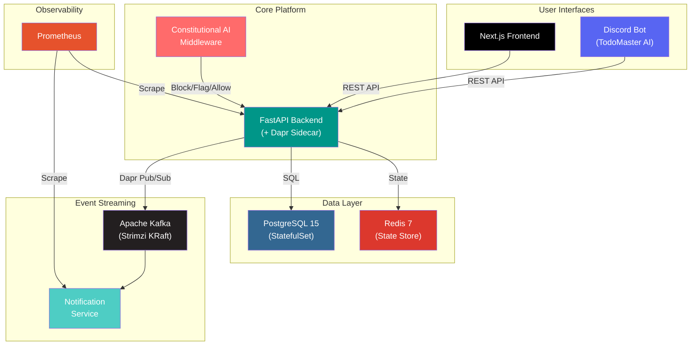

<div align="center">

[](https://git.io/typing-svg)

[](https://www.linkedin.com/in/asadullah-shafique-a00679325)
[](https://medium.com/@texcotembroiderysourcinghouse)
[](https://youtube.com/@asadullahshafique4261)
[](https://linktr.ee/asadullahshafique)
[](https://www.facebook.com/asadullah.shafique?mibextid=ZbWKwL)

</div>

---

## About Me

I'm an **Agentic AI Developer** at Panaversity building autonomous AI systems that take action, not just respond. I recently completed **6 progressive hackathons** — evolving a simple file watcher into a full **Kubernetes-orchestrated platform** with Constitutional AI safety, Apache Kafka event streaming, Dapr service mesh, and a Discord bot.

<table>
<tr>
<td width="50%">

```yaml
Hackathons Completed : 6/6 (Bronze → Platinum)
Kubernetes Services  : 14 running in 6GB cluster
Tests Passing        : 180+
Architecture         : Event-Driven + Constitutional AI
Methodology          : Specification-First Development
```

</td>
<td width="50%">

**Currently Building:**
- Multi-agent systems with **MCP** & **A2A** protocols
- Production RAG with vector databases
- Platform engineering for AI workloads
- Open-source AI safety tooling

</td>
</tr>
</table>

---

## Flagship Project

### [Hackathon Completion Engine](https://github.com/asadullah48/hackathon-completion-engine)

<div align="center">

[]()
[]()
[]()
[]()
[]()
[]()

</div>

A production-grade, Kubernetes-orchestrated AI application built progressively across 6 hackathons, featuring **Constitutional AI safety**, event-driven microservices, and multi-interface access.



<details>
<summary><b>Key Differentiators</b></summary>

| Feature | Implementation |
|---------|---------------|
| **Constitutional AI** | Blocks homework-solving queries with Socratic responses, flags edge cases for human review |
| **Zero-Code Infra Swap** | Switched pub/sub from Redis → Kafka by changing 1 YAML file (Dapr abstraction) |
| **14 Services in 6GB** | Full production stack at 44% memory utilization on Minikube |
| **Event-Driven Audit** | Every interaction published to Kafka with 24h retention |
| **Multi-Interface** | Same backend serves Next.js frontend + Discord bot (TodoMaster AI) |

</details>

<details>
<summary><b>Hackathon Progression (Bronze → Platinum)</b></summary>

| Hackathon | Project | Tier | What I Built | Tests |
|-----------|---------|------|-------------|-------|
| **H0** | Personal AI CTO | `Bronze` | File watcher, auto-categorization, HITL approvals | 7/7 |
| **H1** | Course Companion | `Silver` | FastAPI backend, Constitutional AI filter, conversation tracking | - |
| **H2** | AI-Powered Todo | `Silver` | Spec-driven development, AI spec generation, CRUD with constitution | - |
| **H3** | Advanced Todo | `Gold` | Event-driven architecture, Kafka, Dapr, team collaboration | 149/149 |
| **H4** | Cloud-Native | `Platinum` | Full Kubernetes cluster (14 manifests), CI/CD, Prometheus | - |
| **H4.5** | Discord Bot | `Extended` | TodoMaster AI with 6 slash commands, K8s deployment | 31/31 |

</details>

---

## Other Projects

| Project | Stack | Description |
|---------|-------|-------------|
| **Physical AI Textbook Platform** | Next.js, FastAPI, RAG, Gemini API | Interactive textbook with semantic search and context-aware RAG chatbot |
| **LearnFlow AI Platform** | Microservices, FastAPI, K8s, Docker | 5 specialized AI agents for personalized programming education |
| **Course Companion FTE** | FastAPI, ChatGPT API, Zero-Backend | Constitutional AI rules for LLM-based course management |
| **Claude.ai Skills Marketplace** | 39 Skills, 8 Categories | Reusable agent skills — document processing, automation, dev tools |

---

## Tech Stack

<div align="center">

**Languages & Frameworks**

[](https://skillicons.dev)

**Cloud-Native & Infrastructure**

[](https://skillicons.dev)

**AI, Tools & Platforms**

[](https://skillicons.dev)

</div>

<details>
<summary><b>Full Stack Breakdown</b></summary>

```javascript
const stack = {
    languages:      ["Python", "TypeScript", "JavaScript"],
    frontend:       ["Next.js 14", "React", "Tailwind CSS"],
    backend:        ["FastAPI", "Node.js", "Uvicorn"],
    ai:             ["Constitutional AI", "RAG Systems", "LangChain", "LangGraph", "MCP"],
    databases:      ["PostgreSQL 15", "Redis 7", "Vector DBs (Pinecone, Chroma)"],
    infrastructure: ["Kubernetes", "Docker", "Dapr", "Helm"],
    streaming:      ["Apache Kafka (Strimzi KRaft)"],
    monitoring:     ["Prometheus", "Grafana", "OpenTelemetry"],
    cicd:           ["GitHub Actions (test → build → validate → security)"],
    bots:           ["discord.py (slash commands)"],
    apis:           ["OpenAI", "Claude (Anthropic)", "Google Gemini"],
    protocols:      ["MCP (Model Context Protocol)", "A2A", "REST", "Dapr Pub/Sub"],
    architecture:   ["Microservices", "Event-Driven", "API-First", "Infrastructure-Agnostic"],
    methodology:    "Specification-First Development"
};
```

</details>

---

## 2026 Technology Roadmap

<div align="center">


</div>

| Area | Technologies | Why It Matters |
|------|-------------|----------------|
| **Agent Protocols** | MCP, A2A (Google/Linux Foundation), Claude Agent SDK | Standardizing how AI agents communicate and use tools |
| **Multi-Agent Systems** | LangGraph, CrewAI, AutoGen, OpenAI Swarm | Orchestrating specialized agents for complex workflows |
| **Observability** | OpenTelemetry, Grafana Stack (Loki + Tempo) | Unified telemetry for AI-native applications |
| **Vector Databases** | Pinecone, Qdrant, Chroma, Weaviate | Scaling RAG systems to production |
| **Edge AI** | WebAssembly (Wasm), ONNX Runtime | Running inference at the edge without cloud dependency |
| **Platform Engineering** | Backstage, Crossplane, Terraform | Building internal developer platforms for AI workloads |
| **AI Safety** | Constitutional AI, RLHF, Human-in-the-Loop | Ensuring AI systems are safe and aligned |

---

## GitHub Stats

<div align="center">

[](https://github.com/ryo-ma/github-profile-trophy)


[](https://github.com/anuraghazra/github-readme-stats)

[](https://github.com/Ashutosh00710/github-readme-activity-graph)

<picture>
  <source media="(prefers-color-scheme: dark)" srcset="https://raw.githubusercontent.com/asadullah48/asadullah48/output/github-snake-dark.svg" />
  <source media="(prefers-color-scheme: light)" srcset="https://raw.githubusercontent.com/asadullah48/asadullah48/output/github-snake.svg" />
  
</picture>

</div>

---

## Goals

- [x] Complete all 5 Panaversity Hackathons (Bronze → Platinum)
- [x] Build cloud-native system with Kubernetes, Kafka, and Dapr
- [x] Implement Constitutional AI safety with Human-in-the-Loop
- [ ] Build multi-agent system with MCP and A2A protocols
- [ ] Contribute to 3+ open-source AI/ML projects
- [ ] Publish 24+ technical articles and videos
- [ ] Launch course on Specification-Driven AI Development
- [ ] Grow YouTube channel to 1K+ subscribers

---

## Philosophy

> *"Traditional approach: Avoid AI mistakes.*
> *My approach: **Learn FROM AI mistakes.***
> *Because real innovation happens at the edges of failure."*

| Principle | Practice |
|-----------|----------|
| **Spec-First** | No code without a specification |
| **Production Quality** | Every project is deployment-ready |
| **AI as Collaborator** | Not just a tool — a thinking partner |
| **Open Source** | Share knowledge, elevate the community |

---

## Writing & Content

<div align="center">

[](https://youtube.com/@asadullahshafique4261)
[](https://medium.com/@texcotembroiderysourcinghouse)

</div>

**Topics:** Agentic AI | Spec-Driven Development | Cloud-Native Architecture | Constitutional AI Safety | Multi-Agent Systems

---

<div align="center">

### Let's build something together

I'm open to collaborating on **AI/ML projects**, **cloud-native systems**, and **hackathon partnerships**.

[](https://www.linkedin.com/in/asadullah-shafique-a00679325)
[](https://medium.com/@texcotembroiderysourcinghouse)
[](https://youtube.com/@asadullahshafique4261)
[](https://www.facebook.com/asadullah.shafique?mibextid=ZbWKwL)
[](https://linktr.ee/asadullahshafique)


</div>


