<div align="center">

[](https://git.io/typing-svg)

<br/>

<a href="https://www.linkedin.com/in/asadullah-shafique-a00679325"></a>&nbsp;
<a href="https://medium.com/@texcotembroiderysourcinghouse"></a>&nbsp;
<a href="https://youtube.com/@asadullahshafique4261"></a>&nbsp;
<a href="https://linktr.ee/asadullahshafique"></a>&nbsp;
<a href="https://www.facebook.com/asadullah.shafique?mibextid=ZbWKwL"></a>

</div>

<br/>

<!-- ═══════════════════════════════════════════════════════════════ -->
##  &nbsp;About Me
<!-- ═══════════════════════════════════════════════════════════════ -->

I'm an **Agentic AI Developer** at [Panaversity](https://github.com/panaversity) building autonomous AI systems that take action, not just respond. I completed **6 progressive hackathons** — evolving a simple file watcher into a full **Kubernetes-orchestrated platform** with Constitutional AI safety, Apache Kafka event streaming, Dapr service mesh, and a Discord bot.

<table>
<tr>
<td width="50%" valign="top">

###  &nbsp;At a Glance

```yaml
Hackathons Completed : 6/6 (Bronze → Platinum)
Kubernetes Services  : 14 running in 6GB cluster
Tests Passing        : 180+
Architecture         : Event-Driven + Constitutional AI
Methodology          : Specification-First Development
Current Focus        : Multi-Agent Systems (MCP + A2A)
```

</td>
<td width="50%" valign="top">

###  &nbsp;Currently Building

- 🤖 Multi-agent systems with **MCP** & **A2A** protocols
- 🧠 Production RAG with vector databases
- ☁️ Platform engineering for AI workloads
- 🛡️ Open-source AI safety tooling
- 📝 Technical content on **YouTube** & **Medium**

</td>
</tr>
</table>

<br/>

<!-- ═══════════════════════════════════════════════════════════════ -->
##  &nbsp;Flagship Project
<!-- ═══════════════════════════════════════════════════════════════ -->

<div align="center">

### [🏆 Hackathon Completion Engine](https://github.com/asadullah48/hackathon-completion-engine)

<br/>

<a href="https://github.com/asadullah48/hackathon-completion-engine">
  &nbsp;
  &nbsp;
  &nbsp;
  &nbsp;
  &nbsp;
  
</a>

</div>

<br/>

> A production-grade, Kubernetes-orchestrated AI application built progressively across 6 hackathons — featuring **Constitutional AI safety**, event-driven microservices, and multi-interface access.

```mermaid
graph TD
    subgraph "User Interfaces"
        A["🎮 Discord Bot<br/>(TodoMaster AI)"]
        C["🌐 Next.js Frontend"]
    end

    subgraph "Core Platform"
        B["⚡ FastAPI Backend<br/>(+ Dapr Sidecar)"]
        I["🛡️ Constitutional AI<br/>Middleware"]
    end

    subgraph "Data Layer"
        D["🗄️ PostgreSQL 15<br/>(StatefulSet)"]
        H["📦 Redis 7<br/>(State Store)"]
    end

    subgraph "Event Streaming"
        E["📡 Apache Kafka<br/>(Strimzi KRaft)"]
        F["🔔 Notification<br/>Service"]
    end

    subgraph "Observability"
        G["📊 Prometheus"]
    end

    A -->|REST API| B
    C -->|REST API| B
    I -->|Block/Flag/Allow| B
    B -->|SQL| D
    B -->|State| H
    B -->|Dapr Pub/Sub| E
    E --> F
    G -->|Scrape| B
    G -->|Scrape| F

    style A fill:#5865F2,color:#fff,stroke:#5865F2
    style C fill:#000000,color:#fff,stroke:#333
    style B fill:#009688,color:#fff,stroke:#009688
    style I fill:#EF4444,color:#fff,stroke:#EF4444
    style D fill:#336791,color:#fff,stroke:#336791
    style H fill:#DC382D,color:#fff,stroke:#DC382D
    style E fill:#231f20,color:#fff,stroke:#555
    style F fill:#4ECDC4,color:#fff,stroke:#4ECDC4
    style G fill:#e6522c,color:#fff,stroke:#e6522c
```



<details>
<summary>&nbsp;<b>⚡ Key Differentiators</b></summary>

<br/>

| Feature | Implementation |
|:--------|:---------------|
| 🛡️ **Constitutional AI** | Blocks homework-solving queries with Socratic responses, flags edge cases for human review |
| 🔄 **Zero-Code Infra Swap** | Switched pub/sub from Redis → Kafka by changing 1 YAML file (Dapr abstraction) |
| 📦 **14 Services in 6GB** | Full production stack at 44% memory utilization on Minikube |
| 📡 **Event-Driven Audit** | Every interaction published to Kafka with 24h retention |
| 🌐 **Multi-Interface** | Same backend serves Next.js frontend + Discord bot (TodoMaster AI) |

</details>

<details>
<summary>&nbsp;<b>📈 Hackathon Progression (Bronze → Platinum)</b></summary>

<br/>

| Hackathon | Project | Tier | What I Built | Tests |
|:----------|:--------|:-----|:-------------|:------|
| **H0** | Personal AI CTO | `🥉 Bronze` | File watcher, auto-categorization, HITL approvals | 7/7 |
| **H1** | Course Companion | `🥈 Silver` | FastAPI backend, Constitutional AI filter, conversation tracking | — |
| **H2** | AI-Powered Todo | `🥈 Silver` | Spec-driven development, AI spec generation, CRUD with constitution | — |
| **H3** | Advanced Todo | `🥇 Gold` | Event-driven architecture, Kafka, Dapr, team collaboration | 149/149 |
| **H4** | Cloud-Native | `💎 Platinum` | Full Kubernetes cluster (14 manifests), CI/CD, Prometheus | — |
| **H4.5** | Discord Bot | `🚀 Extended` | TodoMaster AI with 6 slash commands, K8s deployment | 31/31 |

</details>

<br/>

<!-- ═══════════════════════════════════════════════════════════════ -->
##  &nbsp;Other Projects
<!-- ═══════════════════════════════════════════════════════════════ -->

<div align="center">

| Project | Stack | Description |
|:--------|:------|:------------|
| 📚 **Physical AI Textbook Platform** | Next.js, FastAPI, RAG, Gemini API | Interactive textbook with semantic search and context-aware RAG chatbot |
| 🎓 **LearnFlow AI Platform** | Microservices, FastAPI, K8s, Docker | 5 specialized AI agents for personalized programming education |
| 🤖 **Course Companion FTE** | FastAPI, ChatGPT API, Zero-Backend | Constitutional AI rules for LLM-based course management |
| 🧩 **Claude.ai Skills Marketplace** | 39 Skills, 8 Categories | Reusable agent skills — document processing, automation, dev tools |

</div>

<br/>

<!-- ═══════════════════════════════════════════════════════════════ -->
## 🛠️ &nbsp;Tech Stack
<!-- ═══════════════════════════════════════════════════════════════ -->

<div align="center">

**`Languages & Frameworks`**

[](https://skillicons.dev)

**`Cloud-Native & Infrastructure`**

[](https://skillicons.dev)

**`AI, Tools & Platforms`**

[](https://skillicons.dev)

</div>

<details>
<summary>&nbsp;<b>📋 Full Stack Breakdown</b></summary>

<br/>

```javascript
const asadullah = {
    languages:      ["Python", "TypeScript", "JavaScript"],
    frontend:       ["Next.js 14", "React", "Tailwind CSS"],
    backend:        ["FastAPI", "Node.js", "Uvicorn"],
    ai:             ["Constitutional AI", "RAG Systems", "LangChain", "LangGraph", "MCP"],
    databases:      ["PostgreSQL 15", "Redis 7", "Vector DBs (Pinecone, Chroma)"],
    infrastructure: ["Kubernetes", "Docker", "Dapr", "Helm"],
    streaming:      ["Apache Kafka (Strimzi KRaft)"],
    monitoring:     ["Prometheus", "Grafana", "OpenTelemetry"],
    cicd:           ["GitHub Actions (test → build → validate → security)"],
    bots:           ["discord.py (slash commands)"],
    apis:           ["OpenAI", "Claude (Anthropic)", "Google Gemini"],
    protocols:      ["MCP (Model Context Protocol)", "A2A", "REST", "Dapr Pub/Sub"],
    architecture:   ["Microservices", "Event-Driven", "API-First", "Infrastructure-Agnostic"],
    methodology:    "Specification-First Development"
};
```

</details>

<br/>

<!-- ═══════════════════════════════════════════════════════════════ -->
## 🗺️ &nbsp;2026 Technology Roadmap
<!-- ═══════════════════════════════════════════════════════════════ -->

<div align="center">


</div>

| Area | Technologies | Why It Matters |
|:-----|:-------------|:---------------|
| 🔌 **Agent Protocols** | MCP, A2A (Google/Linux Foundation), Claude Agent SDK | Standardizing how AI agents communicate and use tools |
| 🤖 **Multi-Agent Systems** | LangGraph, CrewAI, AutoGen, OpenAI Swarm | Orchestrating specialized agents for complex workflows |
| 📊 **Observability** | OpenTelemetry, Grafana Stack (Loki + Tempo) | Unified telemetry for AI-native applications |
| 🗃️ **Vector Databases** | Pinecone, Qdrant, Chroma, Weaviate | Scaling RAG systems to production |
| ⚡ **Edge AI** | WebAssembly (Wasm), ONNX Runtime | Running inference at the edge without cloud dependency |
| 🏗️ **Platform Engineering** | Backstage, Crossplane, Terraform | Building internal developer platforms for AI workloads |
| 🛡️ **AI Safety** | Constitutional AI, RLHF, Human-in-the-Loop | Ensuring AI systems are safe and aligned |

<br/>

<!-- ═══════════════════════════════════════════════════════════════ -->
## 📊 &nbsp;GitHub Analytics
<!-- ═══════════════════════════════════════════════════════════════ -->

<div align="center">

[](https://github.com/ryo-ma/github-profile-trophy)

<br/>


<br/>

[](https://github.com/anuraghazra/github-readme-stats)

<br/>

[](https://github.com/Ashutosh00710/github-readme-activity-graph)

<br/>

<picture>
  <source media="(prefers-color-scheme: dark)" srcset="https://raw.githubusercontent.com/asadullah48/asadullah48/output/github-snake-dark.svg" />
  <source media="(prefers-color-scheme: light)" srcset="https://raw.githubusercontent.com/asadullah48/asadullah48/output/github-snake.svg" />
  
</picture>

</div>

<br/>

<!-- ═══════════════════════════════════════════════════════════════ -->
## 🎯 &nbsp;Goals
<!-- ═══════════════════════════════════════════════════════════════ -->

- [x] Complete all 5 Panaversity Hackathons (Bronze → Platinum)
- [x] Build cloud-native system with Kubernetes, Kafka, and Dapr
- [x] Implement Constitutional AI safety with Human-in-the-Loop
- [ ] Build multi-agent system with MCP and A2A protocols
- [ ] Contribute to 3+ open-source AI/ML projects
- [ ] Publish 24+ technical articles and videos
- [ ] Launch course on Specification-Driven AI Development
- [ ] Grow YouTube channel to 1K+ subscribers

<br/>

<!-- ═══════════════════════════════════════════════════════════════ -->
## 💡 &nbsp;Philosophy
<!-- ═══════════════════════════════════════════════════════════════ -->

<div align="center">

```
💡 "Traditional approach: Avoid AI mistakes.
    My approach: Learn FROM AI mistakes.
    Because real innovation happens at the edges of failure."
```

</div>

| Principle | Practice |
|:----------|:---------|
| 📐 **Spec-First** | No code without a specification |
| 🚀 **Production Quality** | Every project is deployment-ready |
| 🤝 **AI as Collaborator** | Not just a tool — a thinking partner |
| 🌍 **Open Source** | Share knowledge, elevate the community |

<br/>

<!-- ═══════════════════════════════════════════════════════════════ -->
## ✍️ &nbsp;Writing & Content
<!-- ═══════════════════════════════════════════════════════════════ -->

<div align="center">

<a href="https://youtube.com/@asadullahshafique4261"></a>&nbsp;
<a href="https://medium.com/@texcotembroiderysourcinghouse"></a>

<br/><br/>

**Topics:** `Agentic AI` &bull; `Spec-Driven Development` &bull; `Cloud-Native Architecture` &bull; `Constitutional AI Safety` &bull; `Multi-Agent Systems`

</div>

<br/>

<!-- ═══════════════════════════════════════════════════════════════ -->

<div align="center">


<br/>

### 🤝 &nbsp;Let's Build Something Together

I'm open to collaborating on **AI/ML projects**, **cloud-native systems**, and **hackathon partnerships**.

<br/>

<a href="https://www.linkedin.com/in/asadullah-shafique-a00679325"></a>&nbsp;&nbsp;
<a href="https://medium.com/@texcotembroiderysourcinghouse"></a>&nbsp;&nbsp;
<a href="https://youtube.com/@asadullahshafique4261"></a>&nbsp;&nbsp;
<a href="https://www.facebook.com/asadullah.shafique?mibextid=ZbWKwL"></a>&nbsp;&nbsp;
<a href="https://linktr.ee/asadullahshafique"></a>

<br/><br/>


</div>

<br/>


